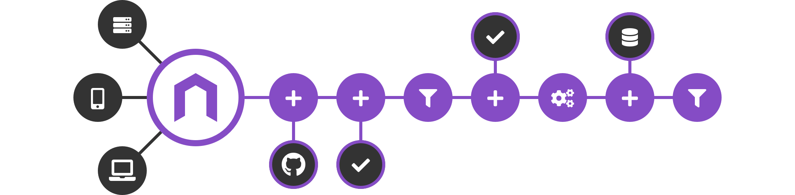

The easy plugin to programmatically manage a horizontally scalable JSON API Gateway. Built on top of
[Express](url-express) & [Request](url-request).

[![CircleCI][circleci-badge]][circleci-url]
[![Dependencies status][david-badge]][david-url]
[![Coverage status][coveralls-badge]][coveralls-url]
[![Version][version-badge]][version-url]

```js
const nodegate = require('nodegate');
const gate = nodegate();
const { aggregate } = nodegate.modifiers;

gate.route({
  method: 'get',
  path: '/user/:user',
  workflow: [
    aggregate('get', 'https://api.github.com/users/{params.user}'),
    aggregate('get', 'https://api.github.com/users/{params.user}/gists'),
  ],
});

gate.listen(8080);
```

## Usage



This plugin will help you to solve the well known problem of [API management][url-wiki-api-management].
Some people are doing this by themselves, others by using complex tools or services. But even with
this kind of systems you will have to program some mechanics. **Nodegate** helps you to
programmatically configure, develop and run your API gateway, in the simple way.

> Everything can be done by declaring routes with a workflow containing modifiers. Each modifier
> _modify_ a container for composing the response. That's it.

A bunch of modifiers are bundled with this plugin, but everyone can create more easily!

## Documentation

[The complete documentation can be found here](assets/documentation/README.md)

## License

Copyright (c) Weekendesk SAS.

[MIT](LICENSE)

[circleci-badge]: https://circleci.com/gh/weekendesk/nodegate.svg?style=shield
[circleci-url]: https://circleci.com/gh/weekendesk/nodegate
[david-badge]: https://david-dm.org/weekendesk/nodegate/status.svg
[david-url]: https://david-dm.org/weekendesk/nodegate
[coveralls-badge]: https://coveralls.io/repos/github/weekendesk/nodegate/badge.svg?branch=master
[coveralls-url]: https://coveralls.io/github/weekendesk/nodegate?branch=master
[version-badge]: https://badge.fury.io/js/nodegate.svg
[version-url]: https://badge.fury.io/js/nodegate
[url-express]: https://expressjs.com/
[url-request]: https://github.com/request/request
[url-wiki-api-management]: https://en.wikipedia.org/wiki/API_management
