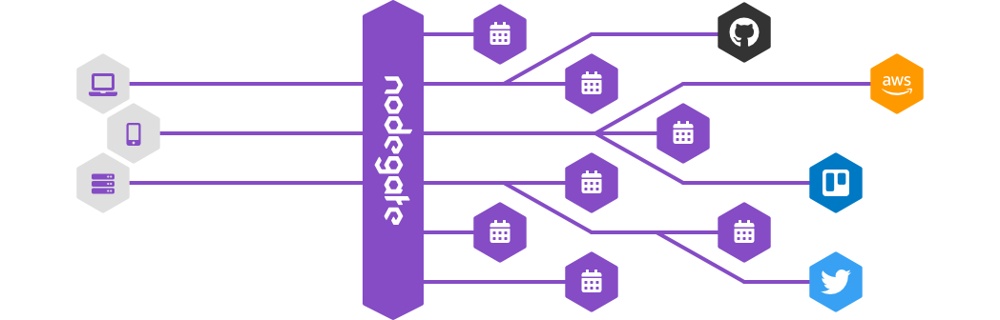

The easy plugin to programmatically manage an API Gateway. Based on top of [Express](https://expressjs.com/) & [Request](https://github.com/request/request).

[![CircleCI][circleci-badge]][circleci-url]
[![Dependencies status][david-badge]][david-url]
[![Coverage status][coveralls-badge]][coveralls-url]
[![Version][version-badge]][version-url]

```js
const nodegate = require('nodegate');
const gate = nodegate();
const { aggregate } = nodegate.modifiers;

gate.route({
  method: 'get',
  path: '/user/:user',
  pipeline: [
    aggregate('get', 'https://api.github.com/users/{params.user}'),
    aggregate('get', 'https://api.github.com/users/{params.user}/gists'),
  ],
});

gate.listen(8080);
```

## Usage



This plugin help you to solve the well known problem of [API management][wiki-api-management].
Some people are doing this by themselves, others by using complex tools or services, but even with this kind of systems you will have to program some mechanics.
This plugin help you to programmatically configure, develop and run your API gateway, in the simple way.

## Installation

You know the drill:

```bash
$ npm install nodegate
```

## Documentation

## License

[MIT](LICENSE)

[circleci-badge]: https://circleci.com/gh/weekendesk/nodegate.svg?style=shield
[circleci-url]: https://circleci.com/gh/weekendesk/nodegate
[david-badge]: https://david-dm.org/weekendesk/nodegate/status.svg
[david-url]: https://david-dm.org/weekendesk/nodegate
[coveralls-badge]: https://coveralls.io/repos/github/weekendesk/nodegate/badge.svg?branch=master
[coveralls-url]: https://coveralls.io/github/weekendesk/nodegate?branch=master
[version-badge]: https://badge.fury.io/js/nodegate.svg
[version-url]: https://badge.fury.io/js/nodegate
[wiki-api-management]: https://en.wikipedia.org/wiki/API_management
